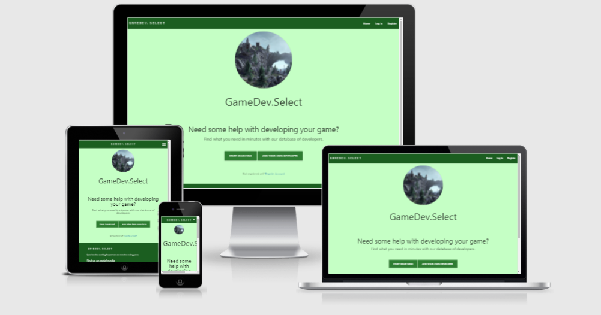

<h1 align="center">Milestone Project 3 - GameDev.Select</h1>

[View the live project here.](https://flask-dev-select-mp.herokuapp.com/)

For the MS3 brief, I have designed a website that uses Flask and MongoDB to create a database of developers. These developers can leave their portfolio links, contact emails, a list of skills and a flag that they can be contacted for work. 

This website also has an Admin panel for admin-flagged users to moderate users, skills and developer entries as necessary.

# User Experience (UX)

# Strategy plane

## Aims of the website

The identified needs of the site have been measured as below: 

*   Provide users with a tool to search for developers by name or by skill
*   Provide developers with a tool to team up with other people to fill skill gaps
*   Allow administration users an easy-access page to moderate entries as appropriate
*   Provide users with an account to manage their own entries, protected with an authenticated password-protected account

The core aims of the website 

## Competitor analysis

I wanted to provide an easy-to-access list of developers that can be easily viewable with one search, utilising as few clicks as possible. I also wanted to provide fields for developers to add details about current projects, as well as an image for their work or for themselves.

I wanted the admin user to have their own dedicated window to easily access all data to then delete or edit as appropriate.

# Scope plane

*   A searchable database that users can access in a few clicks once signing up
*   Dropdown fields that reveal more information about a developer, to avoid hogging too much space
*   Design philosophy that is not elaborate and easy to read
*   Use of session cookie and Flask functionality to allow a user to sign in and manage their data
*   Image upload functionality for more customisation

# Structure plane

This website has a base.html page that provides the skeleton structure of the site - namely its header and footer content. Other pages feed in to this structure, implementing logic where needed to display different information. For example, if a user has entered no developers, their profile page provides a message and a button to encourage them to submit one. 

If a user wishes to exit out of editing a field, they are able to do so. 

*   Consistency – Pages must look, feel and interact in a consistent way. This applies to dropdown fields for developers as well as selecting fields in a table

*   Predictability – The website must respond in a predictable manner - particularly important when users wish to submit their data for the website. Flash messages provide the user with updates based on their status. This includes if a user is trying to access a profile page while not logged in.

*   Learnability – Features must be intuitive and feature single-click learning to prevent visitors becoming frustrating and clicking away

*   Visibility – Features must be visible, with content hinting included as appropriate

*   Feedback – Input fields and clickable events should respond in a way that assures the user that an event is progressing. Messages will flash at the top of the screen if an action is successful, or otherwise if data has not been entered correctly. Form fields also have data verification - for example, if a user inputs an email address incorrectly.

## Database Structure

MongoDB provides the functionality behind this database. The structure is as follows:

**1.  developers**

    _id: A unique ID for this entry to ensure a record is correctly selected.
    first_name:
    last_name:
    description:
    contact_email:
    contact_portfolio:
    looking_for_work:
    skills: [An array of skills will be listed here]
    dev_image:
    img_id: A unique ID for this image to ensure duplicate images will not be entered.

**2.  skills**

    _id: A unique ID for this entry to ensure a record is correctly selected.
    name: Name of the skill to be entered. Only one entry is needed here, as users will pick multiple entries to add to developers within an array.

**3.  users**

    _id: A unique ID for this entry to ensure a record is correctly selected.
    username:
    email:
    password: Using a hash, this password is secure for users to enter into the database to create their session.
    is_admin: Cannot be entered by users. This status can only be changed by other admin users.

# Skeleton plane

## Wireframes

-   Starting state - [View](docs/wireframes/wireframe1.png)

-   Table of data received from API - [View](docs/wireframes/wireframe2.png)

-   Recipe summary - [View](docs/wireframes/wireframe3.png)

##  Site structure

-   The document will provide new users with the Login, Register and Home pages. Users attempting to reach the Developer info by entering the URL required will be prompted to log-in, and will be redirected to the login page.
-   Registering an account requires an email, a password and a username. Users will then be able to see their entries on their profile. The profile is the only place a user can edit or delete entries. This prevents other users from editing their work.
-   When entering a developer, users are prompted for required information or information that does not meet data verification. An image is not mandatory, and if no image has been provided, there will be replacement text provided in the developer's entry.
-   The checkboxes for skills within the developer entry form are created through a for loop running through the skills collection, and if the admin adds more skills to the selection over time, these will automatically be added. 
-   Admin users have the ability to edit and delete users, developers and skills. Admin users cannot delete other admin users. In future version of this build, I plan to add 'moderator' status that will provide a moderator user the ability to not be able to delete administration users, but also not be able to change the admin status of a user.

    
# Surface plane

## Colour Scheme
I have chosen a green colour style, using dark green to differentiate the header and footer respectively. Entries are coloured white, with the text inside differentiated from the skill 'chips', a style originating from Materialize.

## Icons
Font Awesome icons have been utilised in this project to provide more style to the page. 

# User stories

## First Time Visitor Goals

1. As a First Time Visitor, I want to search for developers to help me with my project.
2. As a First Time Visitor, I want to be able to create an account to store my own skills, or that of my team. I want the ability to create, edit, read and delete my records.

## Returning Visitor Goals

1. As a Returning Visitor, I want to be able to search for records that I have created, or that others have created.
2. As a Returning Visitor, I want to update records that are no longer relevant. I want all of my records in one easy to find place.

## Features

-   CRUD functionality for a user:

    The ability to create records
    The ability to read records
    The ability to update previously created records
    The ability to delete previously created records

-   A search bar that searches through a user's name and skills

-   Flashed messaged to provide feedback to the user

## Technologies Used

### Languages Used

-   [HTML5](https://en.wikipedia.org/wiki/HTML5)
-   [CSS3](https://en.wikipedia.org/wiki/Cascading_Style_Sheets)
-   [JavaScript](https://en.wikipedia.org/wiki/JavaScript)
-   [Python](https://en.wikipedia.org/wiki/Python)

### Frameworks, Libraries & Programs Used

1. [Materialize:](https://materializecss.com/)
    - Bootstrap was used to assist with the responsiveness and styling of the website.
2. [Font Awesome:](https://fontawesome.com/)
    - Font Awesome has been used for icons used in parts of the site.
3. [jQuery:](https://jquery.com/)
    - jQuery has been used to enable certain Materialize content.
4. [Git](https://git-scm.com/)
    - Git has been used as a version control system, which enables viewers to see the deployment history and design process. Github has been used as a storage for this info.
5. [GIMP:](https://www.gimp.org/)
    - GIMP was used to resize images, export to .jpg and .png and recolour some images.
6. [Jinja:](https://jinja.palletsprojects.com/en/2.10.x/)
    - Jinja is the template language for Flask and enables data to be displayed from the python application.
7. [PyMongo:](https://flask-pymongo.readthedocs.io/en/latest/)
    - PyMongo enables the Python application to access the MongoDB database.
8. [MongoDB:](https://www.mongodb.com/)
    - Providing the framework for the database used in this project.
9. [Flask:](https://flask.palletsprojects.com/en/2.0.x/)
    - Flask is the web framework that runs the application.
10. [Balsamiq:](https://balsamiq.com/)
    - Balsamiq has been used for the wireframes attached to this project.

## Testing

The W3C Markup Validator, W3C CSS Validator and JS Hint services were used to validate every page of the project to ensure there were no syntax errors in the project.

-   [W3C Markup Validator](https://jigsaw.w3.org/css-validator/) - All pages pass with no errors.
-   [W3C CSS Validator](https://jigsaw.w3.org/css-validator/) - CSS file passes with no errors.
-   [JS Hint](https://jshint.com/) - JS file passes with no errors Some variables are used by HTML onclick attributes which are not recognised in this check.

### Responsiveness

-   The website has been designed with a mobile-first approach, so all fields should be responsive and should provide ease of use on mobile or tablet devices. Materialize classes have been uses to ensure consistency in the app's scaling up to desktop screen size.
-   The website has been tested on mobile, tablet and desktop devices.

### Further Testing

-   The website has been tested using Chrome Developer Tools to ensure any interactions operate correctly (through manually enabling selectors such as :hover or :active)
-   The website has been tested by other people and feedback has been gathered and acted on.

### Further features

-  Future features will implement pagination, moderator users and further defensive programming for users to get confirmation prior to entering new info or deleting old info.

## Deployment
### GitHub Pages

This website has been deployed using Heroku.

To deploy a page yourself, do the following:

1. Using your preferred IDE, create a Procfile and a requirements.txt for Heroku to know what is needed from the frameworks and libraries you have used. 
1. Commit and push these settings to GitHub, if you are using GitHub.
1. This will require the use of a secret key, an IP, aport, MONGO_DBNAME and MONGO_URI. Ensure this is saved in a file that will NOT be committed to GitHub, as this info is sensitive. This information can be input externally
1. Log into Heroku to set up your account and applicaton, and then enter your environment variables.
1. Heroku has an option to use GitHub as a deployment method. Enable this, and ensure you are using the master branch - this should be the only option at this stage. 
1. You will be provided with a link to access the most recent commit of your website.

### Forking the GitHub Repository
To make a clone, or 'fork' this repository, follow the steps below.

1.  Access your GitHub account and find the relevant repository. If you do not have a Github account, follow the steps to create one.
1.  Access the repository you would like to fork. Click on 'Fork' on the top right of the page.
1.  You will find a copy of the repository in your own Github account.

### Making a Local Clone
How to run this project locally:

1.  Install the GitPod Browser Extension for Chrome.
1.  After installation, restart the browser.
1.  Access your GitHub account and find the relevant repository. If you do not have a Github account, follow the steps to create one.
1.  Click the green "GitPod" button in the top right corner of the repository. 

### How to run this project within a local IDE, such as VSCode:

1.  Access your GitHub account and find the relevant repository. If you do not have a Github account, follow the steps to create one.
1.  Under the repository name, click 'Clone'.
1.  Copy the clone URL for the repository You can click the clipboard icon to do this, or copy directly.
1.  Using an IDE, open a new terminal window.
1.  Navigate to the directory location where you want the cloned directory to be made.
1.  Type 'git clone', and then paste the URL you copied in Step 3, as shown in the next step:
1. `git clone https://github.com/USERNAME/REPOSITORY  `
1.  Press Enter. Your local clone will be created.

### Content

-   CodeInstitute's sample README was used as a guide on how to document a comprehensive design process, and I used this template to inform the layout of my own design journey.

### Media

-   Images are sourced by myself using Google's search engine to find Creative Commons licence images. 

### Acknowledgements

-   Guido Cecilio for useful and helpful feedback during mentoring sessions.

-   Code Institute for the Slack channel and tutor support when encouring technical issues or sudden Gitpod updates.

-   Slack Exchange for helpful tips on specific questions I had during the creation of this project.
